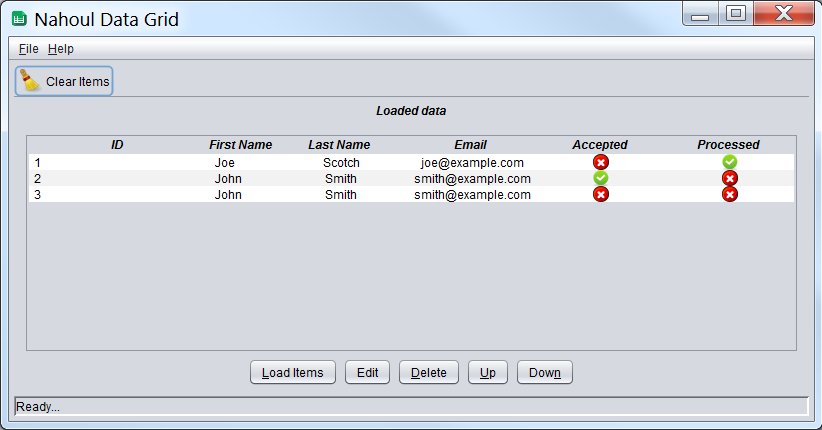

# jDataTable
**What is Nahoul jDataTable?**  
It is a Java Swing-Based and customizable Dynamic Data Grid. It supports loading any kind of data.   
Examples will be provided shortly.    

**Main window**  

